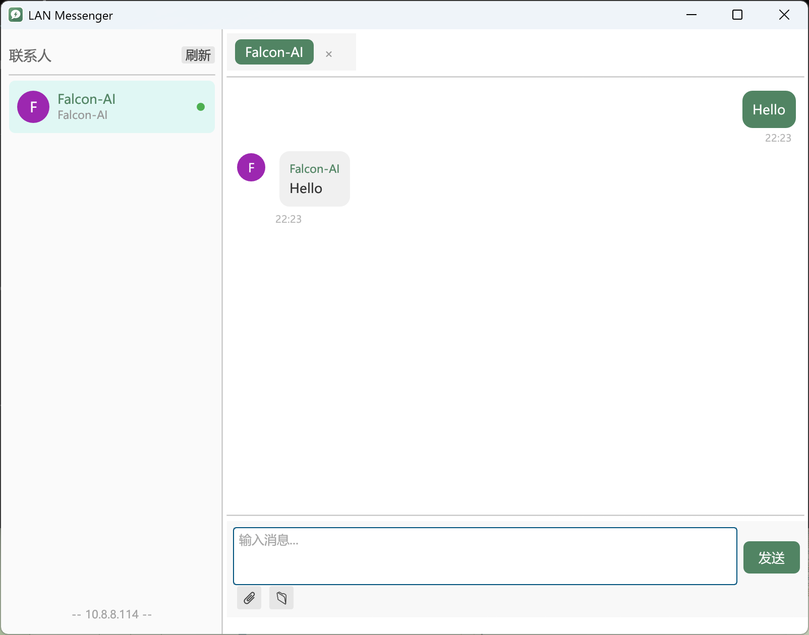

# 局域网通讯软件

> 基于 https://github.com/langzime/ipmsg-rs 改的

## 实现功能
- [✅] 聊天
- [✅] 发送文件
- [✅] 接收文件
- [✅] 刷新用户列表
- [✅] 屏幕截图收发
- [] 界面色彩设置
- [] 用户设置
- [] 网络设置

## 跨平台支持
> windows
> linux
> macos

## 编译运行
防火墙需要打开TCP/UDP 2425端口

> cargo build
> cargo run

## 截图

